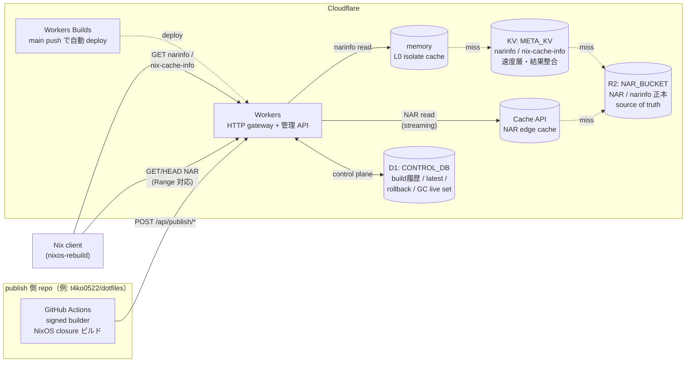

# cf-edgeNix

[English](README.md) | **日本語**

Cloudflare Native な NixOS Binary Cache 基盤。  
GitHub Actions でビルドした NixOS system closure を、Cloudflare（R2 / KV / D1 / Workers）を通して、 `global binary cache` として配布する。

publish 運用手順は [`docs/publish.md`](docs/publish.md) を参照。

## アーキテクチャ



- **publish workflow は cf-edgeNix ではなく flake を持つ側 repo** に置く。template は [`.github/templates/publish-cache.yml`](.github/templates/publish-cache.yml)。
- Cloudflare Workers Builds が `main` への push で自動 deploy する（GitHub Actions の deploy workflow は使わない）。
- **read path（narinfo / nix-cache-info）は `memory → KV → R2` で完結し D1 を挟まない。**

## Quick Start

初めてセットアップする場合の導線。`nix develop` でシェルに入ってから実行すること。

### 1. 署名鍵の生成

```bash
# 署名鍵を生成（キー名は "nix-cache.example.com-1" など。-1 は rotation 番号）
nix-store --generate-binary-cache-key nix-cache.example.com-1 \
  /path/to/cache-private-key.pem \
  /path/to/cache-public-key.pem

cat /path/to/cache-public-key.pem   # → "nix-cache.example.com-1:xxxx=" をメモ
```

生成した公開鍵は NixOS 設定の `trusted-public-keys` に追加する（後述のクライアント設定参照）。
秘密鍵は GitHub Actions の `CACHE_PRIVATE_KEY` secret にのみ置き、リポジトリにコミットしない。

### 2. Cloudflare リソース作成

```bash
wrangler r2 bucket create cf-edgenix-nar
wrangler kv namespace create META_KV          # 出た id を wrangler.toml の META_KV id へ
wrangler d1 create cf-edgenix-control         # 出た id を wrangler.toml の CONTROL_DB database_id へ
```

### 3. D1 migration 適用

```bash
bun run db:migrate:remote
```

### 4. Worker デプロイ

deploy 前に `wrangler.toml` の `[vars]` にある `CF_ACCOUNT_ID = "REPLACE_WITH_CLOUDFLARE_ACCOUNT_ID"` を実 Cloudflare Account ID へ書き換える。

#### 初回デプロイ（手動）

```bash
bun run deploy
# 出力の URL（例: https://cf-edgenix.<account>.workers.dev）を API_BASE_URL として記録する
```

#### 以後の自動デプロイ（Cloudflare Workers Builds）

`main` への push を契機に Cloudflare 側で自動 deploy する。GitHub Actions の deploy workflow は持たない。

Cloudflare Dashboard → Workers & Pages → `cf-edgenix` → Settings → **Build** で GitHub repo を connect し、以下を設定する:

- **Production branch**: `main`
- **Build command**: `bun install`
- **Deploy command**: `npx wrangler d1 migrations apply CONTROL_DB --remote && npx wrangler deploy`
- **Root directory**: `/`

CF 側に置く必要があるのは Workers Builds 用の Cloudflare 権限のみで、GitHub Secret に Cloudflare token は不要になる。

### 5. クライアント側設定（NixOS）

```nix
{
  nix.settings = {
    extra-substituters = [ "https://cf-edgenix.<account>.workers.dev" ];
    extra-trusted-public-keys = [ "nix-cache.example.com-1:xxxx=" ];
  };
}
```

### 6. 初回 publish

publish workflow は **このレポではなく、flake を持つ側の repo** （例: `t4ko0522/dotfiles`）に置く。テンプレート [`.github/templates/publish-cache.yml`](.github/templates/publish-cache.yml) を相手側の `.github/workflows/` にコピーし、`matrix.host` を実 nixosConfiguration 名に書き換える。

呼び出し側 repo の Environment (`production`) に以下の Secret / Variable を登録してから push または手動実行する。

| 名前 | 種別 | 用途 |
| --- | --- | --- |
| `CACHE_PRIVATE_KEY` | Secret | NAR 署名用秘密鍵（§1 で生成したもの） |
| `ADMIN_TOKEN` | Secret | Worker 管理 API の Bearer トークン |
| `CLOUDFLARE_API_TOKEN` | Secret | R2 write / KV write 最小権限トークン |
| `CLOUDFLARE_ACCOUNT_ID` | Variable | Cloudflare アカウント ID |
| `API_BASE_URL` | Variable | §4 で記録した Worker の URL |
| `R2_BUCKET_NAME` | Variable | R2 バケット名（例: `cf-edgenix-nar`） |
| `KV_NAMESPACE_ID` | Variable | KV 名前空間 ID |

各値の詳細・トークン権限・publish フロー全体は [`docs/publish.md`](docs/publish.md) を参照。

## 開発

devShell へ入り方、テスト実行、`.dev.vars` の書き方、publish を手元から叩く手順は [`CONTRIBUTIONS.md`](CONTRIBUTIONS.md) を参照。

## 環境変数・Secret

各変数の用途と設定場所は [`CONTRIBUTIONS.md`](CONTRIBUTIONS.md#環境変数secret) を参照。

## エンドポイント

| メソッド | パス | 認証 | 説明 |
| --- | --- | --- | --- |
| GET | `/nix-cache-info` | 不要 | cache メタ情報 |
| GET | `/<store-hash>.narinfo` | 不要 | narinfo（memory→KV→R2→404） |
| GET/HEAD | `/nar/<file-hash>.nar.zst` | 不要 | NAR 本体（Range: bytes=... / 206 対応・Cache API→R2 streaming） |
| GET | `/api/hosts/:host/latest` | 不要 | host の latest published build |
| GET | `/api/hosts/:host/builds` | 不要 | build 履歴 |
| GET | `/api/builds/:id/manifest.json` | 不要 | 復元用 manifest |
| GET | `/api/quota/status` | 不要 | R2 無料枠 kill-switch の現在 state |
| GET | `/api/quota/metrics` | Bearer | R2 無料枠 kill-switch の詳細 metrics |
| POST | `/api/publish/start` | Bearer | staging build 作成（latest 不変） |
| POST | `/api/publish/:build_id/ingest` | Bearer | store_paths を chunk 分割で冪等投入 |
| POST | `/api/publish/:build_id/finalize` | Bearer | D1 published 確定 + latest 更新（1 batch） |
| POST | `/api/hosts/:host/rollback` | Bearer | rollback root 登録 |
| POST | `/api/gc/dry-run` | Bearer | GC live-set 計算（削除はしない） |
| POST | `/api/quota/reset` | Bearer | kill-switch state を `ok` に手動解除 |
| GET | `/api/openapi.json` | 不要 | OpenAPI 3.0 スキーマ（hono/zod-openapi 自動生成） |

- read 系（GET/HEAD）は認証不要。`nixos-rebuild` から直接叩かれる。
- write 系（POST）は Bearer トークン必須: `Authorization: Bearer <ADMIN_TOKEN>`。
- `ADMIN_TOKEN` 未設定時は write 系を 403 で拒否（安全側）。
- NAR の `GET/HEAD` は `Range: bytes=start-end` / `bytes=start-` / `bytes=-suffix` に対応し 206 を返す。範囲外は 416。
