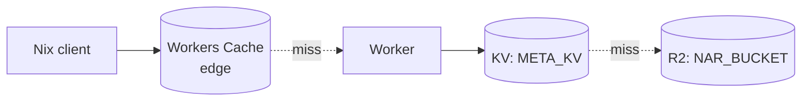
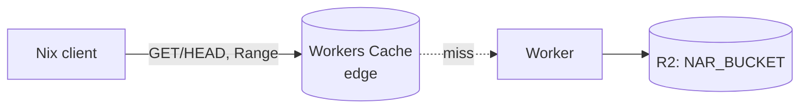
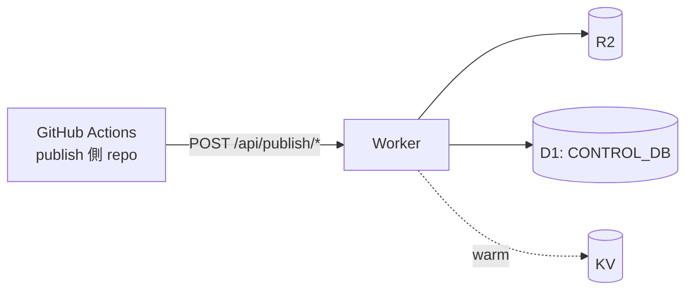
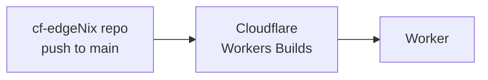

<p align="center">
  
</p>

# Cloudflare-native な NixOS binary cache

[English](README.md) | **日本語**

> cf-edgeNixは独立したプロジェクトであり、Cloudflare社とは提携、推奨、または出資を受けているものではありません。  
Cloudflare、Cloudflare Workers、およびR2は、Cloudflare, Inc.の商標です。  

cf-edgeNix は Cloudflare Workers を署名付き [Nix binary cache](https://nixos.org/manual/nix/stable/command-ref/new-cli/nix3-help-stores.html) に変える。  
R2 が NAR / narinfo の正本、Workers Cache と KV が速度層、D1 が build 履歴・`latest`・rollback root・GC live-set を持つ control plane。read path は narinfo が `Workers Cache → KV → R2`、NAR は `Workers Cache → R2`、いずれも D1 を経由しない。

**Self-hosted、かつ Cloudflare 内で完結。** 自分の Cloudflare アカウントに自分の Worker を deploy する形なので、cache も署名鍵も完全に自分の手元にあり、サードパーティを経由しない。  
さらに実体は Cloudflare のエッジ（Workers + R2 + KV + D1 + Workers Cache + Workers Builds）に閉じており、**VPS も origin server もコンテナも、GitHub Actions の deploy pipeline も不要**。  
Cloudflare の外で動くのは、自分の NixOS flake repo に置いた GitHub Actions job が cf-edgeNix を checkout してその `scripts/publish.sh` を回し、署名済み NAR を build & upload する部分だけ。  
> flake repo 側に publish ロジックは持たず、[`.github/templates/publish-cache.yml`](.github/templates/publish-cache.yml) の workflow テンプレートをそのまま配置するだけで済む。

目標は **Cloudflare 無料枠で global な署名付き binary cache を持つ** こと。5 分おきの Cron が R2 使用量を監視し、課金が発生する前に kill-switch を踏む。

## アーキテクチャ

### Read path — narinfo / nix-cache-info



3 段ルックアップ。Workers Cache ヒット時は Worker 自体が起動しない（request collapsing 内蔵）。KV は結果整合、R2 が正本。R2 にも無ければ `404` を返し、これも 60 秒だけ edge にキャッシュする（negative cache — `nixos-rebuild` は存在しない path を大量に引くため）。

### Read path — NAR 本体



`Range: bytes=...` をエッジまで通す（206 は edge に保存されず常に R2 から streaming）。full 200 は content-addressed かつ immutable として edge にキャッシュされる。miss 時は R2 から buffer せず streaming で返す。

### Publish path



`latest` を動かすのは `start → ingest × N → finalize` の 1 ルートのみ。  
NAR upload → narinfo upload → D1 確定 → KV warming の順で `scripts/publish.ts` が保証し、`test/publish/order.test.ts` で assert している。

### Deploy path



GitHub Actions の deploy workflow は持たない。  
Workers Builds が push のたびに `wrangler d1 migrations apply --remote && wrangler deploy` を回す。

## 機能

### Nix binary cache protocol

- `nix-cache-info`（`Priority` / `WantMassQuery` 設定可）
- 署名付き `.narinfo`（Ed25519 / `nix-store --generate-binary-cache-key`）
- zstd 圧縮 NAR を `/nar/<file-hash>.nar.zst` で配信
- HTTP `Range`（`bytes=start-end` / `bytes=start-` / `bytes=-suffix`）に対応し `206` を返す
- `hono/zod-openapi` で自動生成された OpenAPI 3.0 スキーマを `/api/openapi.json` で公開

### Control plane (D1)

- `staging → ingest → finalize` の 3 段 publish、finalize が 1 つの `db.batch()` で `latest` を atomic に更新
- 決定論的 `build_id` = `sha256(host:system:gitRev:flakeLockHash:toplevelStorePath)[:36]` — 再実行は冪等
- host ごとの build 履歴 + rollback root 登録
- rollback root から到達不能な NAR を返す GC dry-run

### Edge & cost

- Workers Cache（edge・Worker 手前）→ KV（narinfo）→ R2（正本）の階層構造。404 も短 TTL の negative cache
- 5 分おきの Cron が Cloudflare GraphQL Analytics から R2 storage / Class A / Class B を読む
- 月次無料枠 80% で `warn`、95% で `killed`。`killed` 中は read path が `503` を返して課金事故を防ぐ
- `POST /api/quota/reset` で手動解除

### Operations

- Bearer 認証付き管理 API（`ADMIN_TOKEN`）。未設定時は write 系を `403` で拒否
- Cloudflare Workers Builds が `main` push で自動 deploy（CI deploy workflow も GitHub Secrets の Cloudflare token も不要）
- publish ごとに R2 へ manifest を保存し cold-start 復元に使う
- Drizzle ORM schema / migration は `migrations/` 配下

## `nixos-rebuild` から cache を使う

```nix
{
  nix.settings = {
    extra-substituters = [ "https://cf-edgenix.<account>.workers.dev" ];
    extra-trusted-public-keys = [ "nix-cache.example.com-1:xxxx=" ];
  };
}
```

`sudo nixos-rebuild switch --flake .#<host>` で反映。設定を書き換えず一度だけ試したい場合:

```bash
sudo nixos-rebuild switch --flake .#myhost \
  --option extra-substituters "https://cf-edgenix.<account>.workers.dev" \
  --option extra-trusted-public-keys "nix-cache.example.com-1:xxxx="
```

`nixos-rebuild` は以下の順で（全て認証なしで）Worker を叩く:

1. `GET /nix-cache-info` — セッションごとに 1 回。`StoreDir` が一致しないと Nix はその cache を拒否する。
2. `GET /<store-hash>.narinfo` — store path ごとに 1 回。`404` なら次の substituter にフォールバック。
3. `GET /nar/<file-hash>.nar.zst` — narinfo がヒットしたときだけ取得。Range で途中再開可能。

疎通確認:

```bash
curl -sSf https://cf-edgenix.<account>.workers.dev/nix-cache-info
curl -sSfI https://cf-edgenix.<account>.workers.dev/<store-hash>.narinfo
```

## ドキュメント

| 項目 | ファイル |
| --- | --- |
| 初回セットアップ（鍵生成・Cloudflare リソース・deploy・クライアント設定） | [`docs/setup.md`](docs/setup.md) |
| publish フロー / 冪等性 / 公開順序 / トラブルシューティング | [`docs/publish.md`](docs/publish.md) |
| エンドポイント一覧 | [`docs/api.md`](docs/api.md) |
| Quota kill-switch 運用 | [`docs/quota.md`](docs/quota.md) |
| 設計仕様（フル） | [`docs/spec.md`](docs/spec.md) |
| 未解決の設計課題 | [`docs/fixme.md`](docs/fixme.md) |
| 開発・テスト・環境変数リファレンス | [`CONTRIBUTING.md`](CONTRIBUTING.md) |
