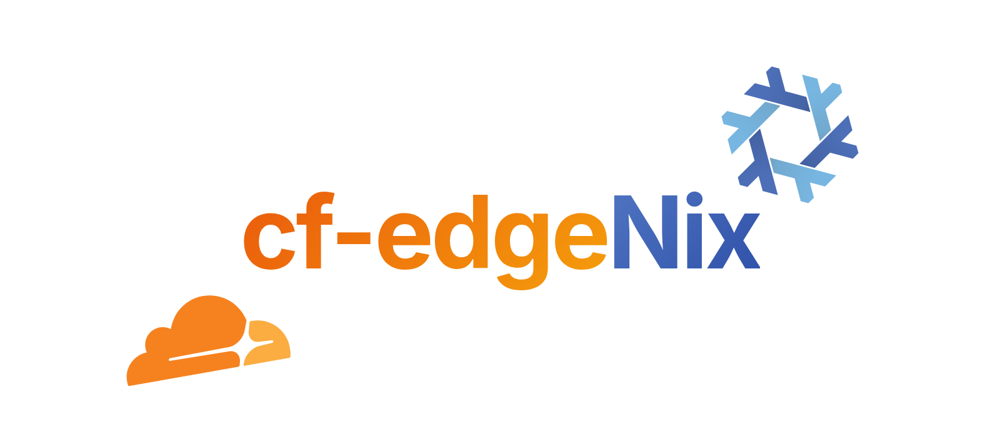
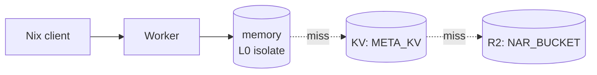
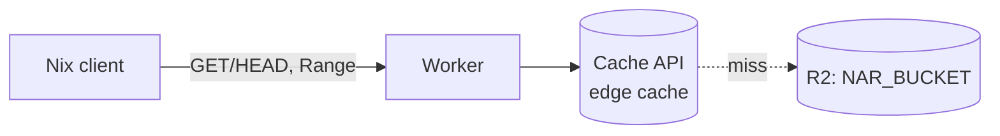
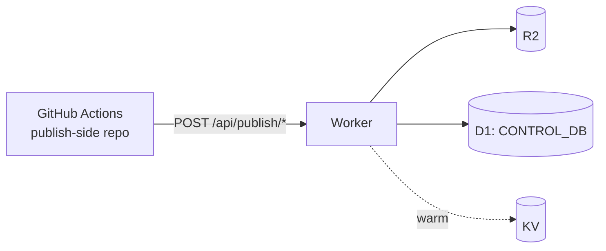
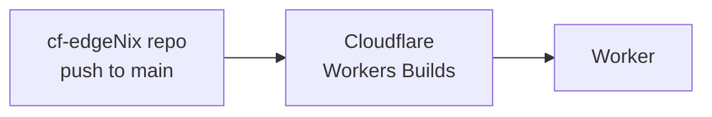

<p align="center">
  
</p>

# Cloudflare-native NixOS binary cache

**English** | [日本語](README.ja.md)

cf-edgeNix turns a Cloudflare Workers deployment into a signed [Nix binary cache](https://nixos.org/manual/nix/stable/command-ref/new-cli/nix3-help-stores.html). R2 holds the canonical NAR / narinfo, KV and the Workers Cache API are the speed layer, and D1 keeps build history, `latest`, rollback roots, and the GC live-set. Reads go `memory → KV → R2` (narinfo) and `Cache API → R2` (NAR); D1 is never on the read path.

The goal is a global, signed binary cache that costs nothing on Cloudflare's free tier. A 5-minute cron tracks R2 quota and trips a kill-switch before you ever bill.

## Architecture

### Read path — narinfo / nix-cache-info



Three-tier lookup. KV is eventually consistent; R2 is the source of truth. `404` from R2 propagates to the client.

### Read path — NAR body



`Range: bytes=...` is honoured end-to-end. Misses stream directly from R2 without buffering.

### Publish path



`start → ingest × N → finalize` is the only path that moves `latest`. NAR uploads precede narinfo; D1 commit precedes KV warming. Order is enforced in `scripts/publish.ts` and asserted in `test/publish/order.test.ts`.

### Deploy path



No GitHub Actions deploy workflow. Workers Builds runs `wrangler d1 migrations apply --remote && wrangler deploy` on every push.

## Features

### Nix binary cache protocol

- `nix-cache-info` with configurable `Priority` and `WantMassQuery`
- Signed `.narinfo` (Ed25519, `nix-store --generate-binary-cache-key`)
- zstd-compressed NAR bodies under `/nar/<file-hash>.nar.zst`
- HTTP `Range` requests (`bytes=start-end`, `bytes=start-`, `bytes=-suffix`) with `206` responses
- OpenAPI 3.0 schema auto-generated via `hono/zod-openapi` at `/api/openapi.json`

### Control plane (D1)

- `staging → ingest → finalize` three-phase publish, finalize moves `latest` in a single `db.batch()`
- Deterministic `build_id` = `sha256(host:system:gitRev:flakeLockHash:toplevelStorePath)[:36]` — re-runs are idempotent
- Per-host build history with rollback root registration
- GC dry-run that returns `dead_candidates` (NARs unreachable from any rollback root)

### Edge & cost

- L0 in-isolate `memory` cache, L1 KV, L2 Cache API for NARs, R2 as source of truth
- 5-minute cron polls Cloudflare GraphQL Analytics for R2 storage / Class A / Class B usage
- `warn` at 80% of monthly free tier, `killed` at 95% — `killed` returns `503` on read paths to prevent billing surprise
- Manual reset via `POST /api/quota/reset`

### Operations

- Bearer-authenticated admin API (`ADMIN_TOKEN`); unset token fails write requests with `403`
- Cloudflare Workers Builds auto-deploys on push to `main` (no CI deploy workflow, no Cloudflare token in GitHub Secrets)
- Per-publish manifest stored in R2 for cold-start restoration
- Drizzle ORM schema, migrations under `migrations/`

## Using the cache from `nixos-rebuild`

```nix
{
  nix.settings = {
    extra-substituters = [ "https://cf-edgenix.<account>.workers.dev" ];
    extra-trusted-public-keys = [ "nix-cache.example.com-1:xxxx=" ];
  };
}
```

Rebuild with `sudo nixos-rebuild switch --flake .#<host>`. For a one-off run:

```bash
sudo nixos-rebuild switch --flake .#myhost \
  --option extra-substituters "https://cf-edgenix.<account>.workers.dev" \
  --option extra-trusted-public-keys "nix-cache.example.com-1:xxxx="
```

`nixos-rebuild` hits the Worker in this order, all unauthenticated:

1. `GET /nix-cache-info` — once per session. Nix refuses the cache if `StoreDir` mismatches.
2. `GET /<store-hash>.narinfo` — one per store path. `404` falls through to the next substituter.
3. `GET /nar/<file-hash>.nar.zst` — fetched only when narinfo signals a hit. Range-resumable.

Quick reachability check:

```bash
curl -sSf https://cf-edgenix.<account>.workers.dev/nix-cache-info
curl -sSfI https://cf-edgenix.<account>.workers.dev/<store-hash>.narinfo
```

## Docs

| Topic | File |
| --- | --- |
| First-time setup (keys, Cloudflare resources, deploy, client) | [`docs/setup.md`](docs/setup.md) |
| Publish flow, idempotency, ordering, troubleshooting | [`docs/publish.md`](docs/publish.md) |
| Endpoint reference | [`docs/api.md`](docs/api.md) |
| Quota kill-switch operations | [`docs/quota.md`](docs/quota.md) |
| Full design spec | [`docs/spec.md`](docs/spec.md) |
| Open design questions | [`docs/fixme.md`](docs/fixme.md) |
| Development, tests, env var reference | [`CONTRIBUTING.md`](CONTRIBUTING.md) |
