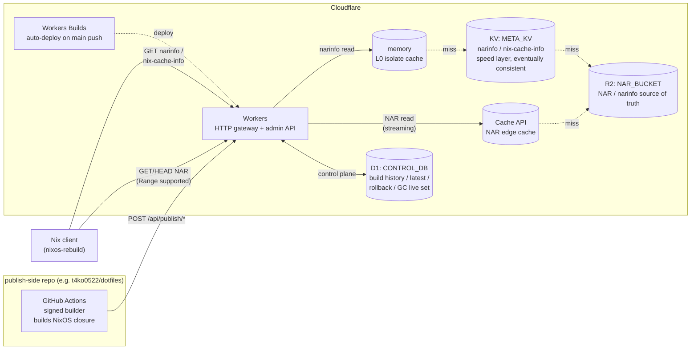

# cf-edgeNix

**English** | [日本語](README.ja.md)

A Cloudflare-native NixOS binary cache.  
GitHub Actions builds the NixOS system closure, and Cloudflare (R2 / KV / D1 / Workers) serves it as a global binary cache.

See [`docs/publish.md`](docs/publish.md) for publish operations.

## Architecture



- **The publish workflow lives in the repo that owns the flake, not in cf-edgeNix.** Use the template at [`.github/templates/publish-cache.yml`](.github/templates/publish-cache.yml).
- Cloudflare Workers Builds auto-deploys on push to `main` (no GitHub Actions deploy workflow).
- **The narinfo / nix-cache-info read path is `memory → KV → R2` and never touches D1.**

## Quick Start

First-time setup walkthrough. Enter the dev shell with `nix develop` before running any of the commands below.

### 1. Generate the signing key

```bash
# Generate a signing key (e.g. "nix-cache.example.com-1"; "-1" is the rotation number)
nix-store --generate-binary-cache-key nix-cache.example.com-1 \
  /path/to/cache-private-key.pem \
  /path/to/cache-public-key.pem

cat /path/to/cache-public-key.pem   # → note down "nix-cache.example.com-1:xxxx="
```

Add the public key to your NixOS `trusted-public-keys` (see the client configuration below).
Keep the private key only in the GitHub Actions `CACHE_PRIVATE_KEY` secret — never commit it.

### 2. Create Cloudflare resources

```bash
wrangler r2 bucket create cf-edgenix-nar
wrangler kv namespace create META_KV          # paste the returned id into wrangler.toml META_KV id
wrangler d1 create cf-edgenix-control         # paste the returned id into wrangler.toml CONTROL_DB database_id
```

### 3. Apply the D1 migration

```bash
bun run db:migrate:remote
```

### 4. Deploy the Worker

Before deploying, replace `CF_ACCOUNT_ID = "REPLACE_WITH_CLOUDFLARE_ACCOUNT_ID"` in `wrangler.toml` `[vars]` with your real Cloudflare account ID.

#### Initial deploy (manual)

```bash
bun run deploy
# Record the resulting URL (e.g. https://cf-edgenix.<account>.workers.dev) as API_BASE_URL
```

#### Subsequent auto-deploys (Cloudflare Workers Builds)

Cloudflare auto-deploys on every push to `main`. No GitHub Actions deploy workflow is needed.

In Cloudflare Dashboard → Workers & Pages → `cf-edgenix` → Settings → **Build**, connect the GitHub repo and configure:

- **Production branch**: `main`
- **Build command**: `bun install`
- **Deploy command**: `npx wrangler d1 migrations apply CONTROL_DB --remote && npx wrangler deploy`
- **Root directory**: `/`

Only the Workers Builds Cloudflare permission is needed on the CF side — no Cloudflare token in GitHub Secrets.

### 5. Configure the client (NixOS)

```nix
{
  nix.settings = {
    extra-substituters = [ "https://cf-edgenix.<account>.workers.dev" ];
    extra-trusted-public-keys = [ "nix-cache.example.com-1:xxxx=" ];
  };
}
```

### 6. First publish

The publish workflow lives in **the repo that owns the flake (e.g. `t4ko0522/dotfiles`), not in this repo**. Copy the template [`.github/templates/publish-cache.yml`](.github/templates/publish-cache.yml) into that repo's `.github/workflows/` and replace `matrix.host` with the actual nixosConfiguration name.

Register the following Secrets / Variables in the calling repo's `production` environment, then push or trigger the workflow manually.

| Name | Kind | Purpose |
| --- | --- | --- |
| `CACHE_PRIVATE_KEY` | Secret | NAR signing key (generated in §1) |
| `ADMIN_TOKEN` | Secret | Bearer token for the Worker admin API |
| `CLOUDFLARE_API_TOKEN` | Secret | Least-privilege Cloudflare token (R2 write / KV write) |
| `CLOUDFLARE_ACCOUNT_ID` | Variable | Cloudflare account ID |
| `API_BASE_URL` | Variable | Worker URL recorded in §4 |
| `R2_BUCKET_NAME` | Variable | R2 bucket name (e.g. `cf-edgenix-nar`) |
| `KV_NAMESPACE_ID` | Variable | KV namespace ID |

Token permissions, value semantics, and the full publish flow are in [`docs/publish.md`](docs/publish.md).

## Development

How to enter the dev shell, run tests, write `.dev.vars`, and invoke publish locally is in [`CONTRIBUTIONS.md`](CONTRIBUTIONS.md).

## Environment Variables / Secrets

The full reference (purpose, where to set, scope) is in [`CONTRIBUTIONS.md`](CONTRIBUTIONS.md#環境変数secret).

## Endpoints

| Method | Path | Auth | Description |
| --- | --- | --- | --- |
| GET | `/nix-cache-info` | none | Cache metadata |
| GET | `/<store-hash>.narinfo` | none | narinfo (memory → KV → R2 → 404) |
| GET/HEAD | `/nar/<file-hash>.nar.zst` | none | NAR body (Range: bytes=..., 206 support, Cache API → R2 streaming) |
| GET | `/api/hosts/:host/latest` | none | Latest published build for a host |
| GET | `/api/hosts/:host/builds` | none | Build history |
| GET | `/api/builds/:id/manifest.json` | none | Restore manifest |
| GET | `/api/quota/status` | none | Current R2 free-tier kill-switch state |
| GET | `/api/quota/metrics` | Bearer | Detailed R2 kill-switch metrics |
| POST | `/api/publish/start` | Bearer | Create a staging build (latest unchanged) |
| POST | `/api/publish/:build_id/ingest` | Bearer | Idempotently insert store_paths in chunks |
| POST | `/api/publish/:build_id/finalize` | Bearer | Mark build published + update latest (single batch) |
| POST | `/api/hosts/:host/rollback` | Bearer | Register a rollback root |
| POST | `/api/gc/dry-run` | Bearer | Compute the GC live-set (does not delete) |
| POST | `/api/quota/reset` | Bearer | Manually reset kill-switch state to `ok` |
| GET | `/api/openapi.json` | none | OpenAPI 3.0 schema (auto-generated via hono/zod-openapi) |

- Read endpoints (GET/HEAD) are unauthenticated — `nixos-rebuild` hits them directly.
- Write endpoints (POST) require a Bearer token: `Authorization: Bearer <ADMIN_TOKEN>`.
- If `ADMIN_TOKEN` is unset, write endpoints return 403 (fail-safe).
- NAR `GET/HEAD` supports `Range: bytes=start-end` / `bytes=start-` / `bytes=-suffix` and returns 206. Out-of-range requests return 416.
